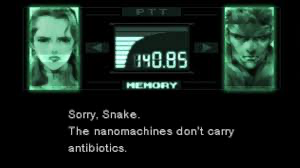
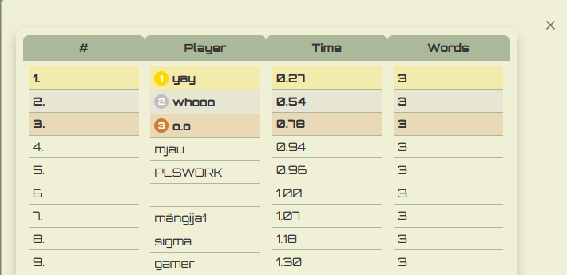

Lõplik kodutöö 2
Lisatud kõik failid. Oma featureid:
1. countdown(3..2...1....START!) koos heliga.
2. New game nupp (sama kasutaja jääb + uuendab skoori kui parem tulemus)
3. Edetabelis väljatoodud TOP 3
4. Edetabelis current score eraldi väljatoodud, et oleks kergem leida.
5. Ingame muusika on pandud loopi peale korduma. (juhul kui aeg otsa saab)
6. Lisaks pildile kuvab tulemuste osas ka "WPM" ja playeri "leveli" vastavalt WPM.
7. Peale igat sõna kirjutamist sõna font randomised.

Igaksjuhuks greeny link:
(https://greeny.cs.tlu.ee/~sophniko/typer/).

NÄIDIS ühest tulemusest:

NÄIDIS edetabelist:

